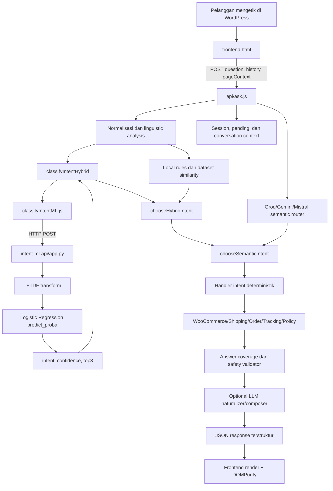

# Panduan Teknis Intent ML dan Alur End-to-End Chatbot Robot Jadul

Dokumen ini adalah panduan teknis untuk memahami, menjelaskan, dan mendemonstrasikan alur chatbot Robot Jadul pada ujian akhir atau live coding. Fokus utamanya adalah perjalanan pertanyaan pelanggan dari browser, klasifikasi intent menggunakan TF-IDF dan Logistic Regression, penggabungan hasil ML dengan rule dan semantic LLM, pengambilan fakta commerce, sampai respons ditampilkan kembali kepada pelanggan.

## 1. Status dan batas bukti

Dokumen ini disusun dari source code aktif pada dua repository:

- `ai-vercel`: frontend WordPress, Vercel Functions, orkestrasi chatbot, rule, LLM, katalog, transaksi, dan renderer.
- `intent-ml-api`: FastAPI untuk inference model intent TF-IDF + Logistic Regression.

Ada tiga tingkat kepastian yang dipakai:

| Penanda | Arti |
| --- | --- |
| **Source aktif** | Perilaku terlihat langsung pada file yang dipakai HEAD saat ini. |
| **Riwayat Git** | Kode pernah ada dan dapat dibuktikan melalui commit, tetapi tidak tersedia sebagai file aktif. |
| **Konsep** | Penjelasan teori untuk membantu sidang; bukan tambahan perilaku baru pada aplikasi. |

Catatan penting tentang reproducibility model:

- Source aktif memuat `intent_model_tfidf_logreg_training_3.joblib`.
- Source training yang dapat ditemukan berada pada commit awal `181d6a8` dengan nama `train_model.py`.
- Script dan dataset persis yang menghasilkan model `training_3.joblib` tidak tersedia di HEAD.
- Karena itu, pipeline TF-IDF + Logistic Regression dapat dibuktikan dari source historis dan interface model aktif, tetapi hyperparameter serta dataset persis model training ketiga belum dapat direproduksi dari repository saat ini.

Jangan menyampaikan model training ketiga sebagai sepenuhnya reproducible sebelum script, dataset, label mapping, versi library, dan metadata training-nya disimpan kembali.

## 2. Ringkasan satu menit untuk penguji

Robot Jadul adalah chatbot commerce berbahasa Indonesia. Ketika pelanggan mengirim pertanyaan, frontend meneruskan teks, riwayat singkat, session ID, dan konteks halaman produk ke endpoint `/api/ask`. Backend menormalisasi bahasa pelanggan dan menjalankan dua jalur pemahaman secara paralel: klasifikasi lokal/hybrid yang dapat memanggil model TF-IDF + Logistic Regression, serta semantic router berbasis LLM bila provider dikonfigurasi. Hasilnya digabungkan dengan confidence threshold dan aturan deterministik.

Intent hanya menentukan jenis kebutuhan pelanggan. Harga, stok, promo, ongkir, order, dan tracking tidak dibuat oleh model. Fakta tersebut diambil dari WooCommerce atau API terkait. Setelah fakta tersedia, sistem memeriksa apakah semua bagian pertanyaan sudah terjawab, menjaga structured payload agar tidak diubah LLM, lalu mengirim JSON ke frontend untuk dirender dan disanitasi.

Kalimat kunci untuk sidang:

> TF-IDF dan Logistic Regression berperan sebagai supervised intent classifier, bukan sebagai generator jawaban dan bukan sebagai sumber fakta bisnis.

## 3. Arsitektur sistem



Pembagian tanggung jawabnya:

| Lapisan | Tanggung jawab | File utama |
| --- | --- | --- |
| Browser | Mengambil input, session, history, konteks halaman, mengirim request, merender response | `wordpress-frontend-chatbot/frontend.html` |
| API chat | Orkestrasi seluruh turn percakapan | `api/ask.js` |
| NLU lokal | Normalisasi, stemming, rule, dataset similarity | `textNormalization.js`, `indonesianMorphology.js`, `linguisticAnalysis.js`, `askLanguage.js` |
| Intent ML client | Memanggil service Python | `lib/classifyIntentML.js` |
| Intent ML server | Memuat model dan melakukan inference | `intent-ml-api/app.py` |
| Decision/fusion | Memvalidasi label/confidence dan menggabungkan ML, rule, dan semantic LLM | `intentDecision.js`, `intentFusion.js` |
| Commerce tools | Mengambil fakta produk, ongkir, order, tracking, dan policy | `wooCatalog.js`, `shippingApi.js`, `transactionStatus.js`, `tracking.js`, `storePolicy.js` |
| Response safety | Coverage, humanizer, structured action, composer validation | `answerCoverage.js`, `responseNaturalizer.js`, `llmAssistant.js` |

## 4. Kontrak request dari frontend

### 4.1 Pertanyaan dibuat oleh pelanggan

**Source aktif:** `ai-vercel/wordpress-frontend-chatbot/frontend.html`, sekitar baris 1500-1570.

```javascript
window.sendQuestion = async function (forcedQuestion = null, options = {}) {
  if (requestInFlight) return;

  const hasImage = !!selectedImage?.dataUrl;
  const question =
    (forcedQuestion || input?.value || "").trim() ||
    (hasImage ? "Tolong carikan produk yang mirip dengan foto ini" : "");
  if (!question && !hasImage) return;

  const imageToSend = hasImage ? selectedImage : null;
  const pageContext = getCurrentProductPageContext();

  const response = await fetch(
    imageToSend
      ? "https://ai-vercel-ten-sigma.vercel.app/api/ask-image"
      : "https://ai-vercel-ten-sigma.vercel.app/api/ask",
    {
      method: "POST",
      headers: {
        "Content-Type": "application/json",
        "X-Session-Id": sessionId,
      },
      body: JSON.stringify({
        question,
        history: recentApiHistory(),
        isSuggestionClick,
        isBootstrap,
        suggestedAction: options.suggestedAction || null,
        pageContext,
      }),
    },
  );
}
```

Yang dikirim bukan hanya teks:

- `question`: pertanyaan pelanggan.
- `history`: maksimum 20 item history terbaru untuk request.
- `X-Session-Id`: identitas percakapan, bukan autentikasi.
- `isSuggestionClick`: membedakan teks biasa dari tombol saran.
- `suggestedAction`: metadata pilihan yang divalidasi backend.
- `pageContext`: ID, nama, dan URL produk WooCommerce yang sedang dibuka.

Contoh request konseptual:

```http
POST /api/ask
Content-Type: application/json
X-Session-Id: session-demo-sidang

{
  "question": "Getter Robo Black Version masih ready dan harganya berapa?",
  "history": [],
  "isSuggestionClick": false,
  "isBootstrap": false,
  "suggestedAction": null,
  "pageContext": null
}
```

## 5. Validasi dan normalisasi di API utama

**Source aktif:** `ai-vercel/api/ask.js`, handler mulai sekitar baris 478.

```javascript
export default async function handler(req, res) {
  res.setHeader("Access-Control-Allow-Origin", "*");
  res.setHeader("Access-Control-Allow-Methods", "POST, OPTIONS");

  if (req.method === "OPTIONS") {
    return res.status(204).end();
  }

  if (req.method !== "POST") {
    return res.status(405).json({ error: "Method not allowed" });
  }

  const body = req.body || {};
  let rawQuestion = String(body.question || "").trim();
  if (!rawQuestion) {
    return res.status(400).json({ type: "text", message: "Pertanyaan kosong" });
  }
}
```

Backend mempertahankan dua bentuk pertanyaan:

- `rawQuestion`: bentuk asli untuk memahami konteks dan maksud pelanggan.
- `effectiveQuestion`: bentuk yang telah dinormalisasi untuk routing dan pencocokan.

Normalisasi di `ask.js` memanggil normalisasi bahasa pelanggan, typo map, dan fuzzy correction:

```javascript
function normalizeQuestion(rawQuestion = "") {
  const q = normalizeCustomerQuestion(rawQuestion);
  const words = q.split(/\s+/);

  const fixed = words.map((w) => {
    if (TYPO_MAP[w]) return TYPO_MAP[w];
    return fuzzyCorrectWord(w, CORRECTION_WORDS);
  });

  return fixed.join(" ");
}
```

Contoh normalisasi yang diharapkan:

| Input pelanggan | Bentuk yang membantu classifier |
| --- | --- |
| `stokk getter msh adaa?` | `stok getter masih ada` |
| `brapa ongkiir ke bandung` | `berapa ongkir ke bandung` |
| `pembayarannya gimana` | mendapat morphology hint `bayar` |
| `dibandingkan voltes sama getter` | mendapat morphology hint `banding` |

### 5.1 Stemming bahasa Indonesia

**Source aktif:** `ai-vercel/lib/chatbot/indonesianMorphology.js`.

```javascript
import nlpLangId from "@nlpjs/lang-id";

const { StemmerId } = nlpLangId;
const stemmer = new StemmerId();

export function stemIndonesianWord(value = "") {
  const normalized = normalizeIndonesianCommerceText(value).toLowerCase();
  if (!/^[a-z]{3,}$/.test(normalized)) return normalized;
  if (PROTECTED_TERMS.has(normalized)) return normalized;

  const overridden = overrideStem(normalized);
  if (overridden) return overridden;

  try {
    const stem = String(stemmer.stemWord(normalized) || "").toLowerCase();
    return /^[a-z]{3,}$/.test(stem) ? stem : normalized;
  } catch {
    return normalized;
  }
}
```

Nama merek, seri, kode, harga, dan resi dilindungi agar stemming tidak merusak identitas seperti `Bandai`, `Chogokin`, `GX-47T`, `500rb`, atau `JP123`.

## 6. Dua jalur pemahaman berjalan paralel

**Source aktif:** `ai-vercel/api/ask.js`, sekitar baris 812-913.

```javascript
const localIntentTask =
  localScopeDecision === "out_of_scope"
    ? Promise.resolve({
        intent: "general",
        method: "out_of_scope_guard",
        score: 1,
      })
    : classifyIntentHybrid(effectiveQuestion);

const groqRouteTask = /* Groq -> Gemini -> Mistral -> null */;

const [localIntentResult, groqRoute] = await Promise.all([
  localIntentTask,
  groqRouteTask,
]);
```

Maknanya:

1. Jalur lokal/hybrid menjalankan ML intent dan rule lokal.
2. Jalur semantic menjalankan LLM bila dikonfigurasi dan memang diperlukan.
3. Keduanya dimulai sebelum backend memilih hasil akhir.
4. `Promise.all` menunggu kedua task selesai.

Konsekuensi performa: jika `INTENT_API_URL` dikonfigurasi tetapi service tidak merespons, request chat dapat ikut menunggu sampai timeout client ML, yaitu 12 detik, walaupun semantic router sudah selesai lebih dahulu.

## 7. Alur TF-IDF dan Logistic Regression

Bagian ini membedakan fase **training** dan **inference**.

### 7.1 Fase training

Training dilakukan sebelum aplikasi menerima request pelanggan. Tujuannya adalah mempelajari hubungan antara pola kata pada pertanyaan dan label intent.

**Bukti riwayat Git:** `intent-ml-api`, commit `181d6a8`, file `train_model.py`.

Untuk melihat sumber historis tanpa mengubah working tree:

```powershell
git -C C:\kumpulan-codingan-fadli\intent-ml-api show 181d6a8:train_model.py
```

Kutipan pipeline training historis:

```python
df = pd.read_csv("dataset_intent_1800_realistic_robotjadul.csv")

X = df["text"].astype(str)
y = df["label"].astype(str)

X_train, X_test, y_train, y_test = train_test_split(
    X,
    y,
    test_size=0.2,
    random_state=42,
    stratify=y
)

model = Pipeline([
    ("tfidf", TfidfVectorizer(
        lowercase=True,
        ngram_range=(1, 2)
    )),
    ("clf", LogisticRegression(
        max_iter=500
    ))
])

model.fit(X_train, y_train)
```

Penjelasan setiap bagian:

| Kode | Fungsi |
| --- | --- |
| `df["text"]` | Fitur masukan berupa kalimat pelanggan. |
| `df["label"]` | Target supervised learning berupa nama intent. |
| `test_size=0.2` | 20% data dipisahkan untuk evaluasi. |
| `random_state=42` | Membuat pembagian data konsisten saat diulang. |
| `stratify=y` | Menjaga proporsi masing-masing intent pada train dan test. |
| `lowercase=True` | Mengubah token menjadi huruf kecil. |
| `ngram_range=(1, 2)` | Memakai unigram dan bigram. |
| `max_iter=500` | Memberi optimizer hingga 500 iterasi untuk konvergen. |
| `model.fit(...)` | TF-IDF mempelajari vocabulary/IDF dan classifier mempelajari bobot kelas. |

Pipeline kemudian dievaluasi dan disimpan:

```python
pred = model.predict(X_test)

print("Accuracy:", accuracy_score(y_test, pred))
print(classification_report(y_test, pred, digits=3))

joblib.dump(model, "intent_tfidf_logreg.joblib")
```

Karena TF-IDF dan classifier berada dalam satu `Pipeline`, artefak Joblib menyimpan kedua tahap. Saat `model.predict([question])` dipanggil, teks otomatis melewati transformasi TF-IDF sebelum masuk ke Logistic Regression.

### 7.2 Apa yang dilakukan TF-IDF?

TF-IDF mengubah kalimat menjadi vektor angka. Ia menaikkan nilai kata yang penting pada sebuah dokumen, tetapi menurunkan nilai kata yang muncul di banyak dokumen.

Secara konseptual:

```text
TF-IDF(t, d) = TF(t, d) × IDF(t)
```

Dengan smoothing default scikit-learn, IDF secara konseptual berbentuk:

```text
IDF(t) = log((1 + jumlah_dokumen) / (1 + dokumen_yang_memuat_t)) + 1
```

Contoh tiga kalimat:

```text
D1: "berapa harga getter"
D2: "ada promo getter"
D3: "stok getter masih ada"
```

Kata `getter` muncul di semua dokumen sehingga kurang diskriminatif. Kata `harga`, `promo`, dan `stok` lebih jarang dan lebih membantu membedakan intent. Bigram juga memungkinkan fitur seperti:

```text
"berapa harga"
"ada promo"
"stok getter"
"masih ada"
```

Jadi TF-IDF tidak memahami makna layaknya manusia. Ia mengukur pola statistik token yang dipelajari dari dataset.

### 7.3 Mengapa memakai unigram dan bigram?

- Unigram menangkap satu kata penting: `harga`, `stok`, `ongkir`, `retur`.
- Bigram menangkap konteks dua kata: `berapa harga`, `status pesanan`, `nomor resi`, `ready stok`.
- Kombinasi keduanya lebih kuat daripada hanya keyword tunggal, tetapi masih ringan untuk inference API.

Keterbatasannya:

- Frasa yang jauh berbeda dari data training dapat salah diklasifikasikan.
- Typo dan slang harus dinormalisasi atau dicontohkan dalam dataset.
- TF-IDF tidak mempunyai memory percakapan.
- TF-IDF tidak mengetahui data WooCommerce.
- TF-IDF tidak menghasilkan jawaban.

### 7.4 Apa yang dilakukan Logistic Regression?

Walaupun namanya regression, Logistic Regression di sini digunakan untuk klasifikasi. Untuk setiap kelas intent, model menghitung skor linear dari vektor TF-IDF:

```text
z_k = w_k · x + b_k
```

Keterangan:

- `x`: vektor TF-IDF pertanyaan.
- `w_k`: bobot fitur untuk intent ke-`k`.
- `b_k`: bias kelas.
- `z_k`: skor kelas sebelum dikonversi menjadi probabilitas.

Probabilitas kemudian dipakai oleh `predict_proba`. Detail strategi multiclass mengikuti versi dan default scikit-learn yang digunakan ketika model dilatih. Source historis tidak menetapkan `solver` atau `multi_class` secara eksplisit, dan dependency aktif belum dipin; karena itu jangan mengklaim konfigurasi solver/model multiclass yang lebih spesifik tanpa membuka metadata artefak di environment Python yang kompatibel.

Kelas dengan probabilitas tertinggi menjadi prediksi. Confidence di project ini adalah probabilitas tertinggi dari `predict_proba`, bukan jaminan bahwa prediksi pasti benar.

### 7.5 Fase inference pada FastAPI

**Source aktif:** `intent-ml-api/app.py`, baris 1-48.

Model dimuat satu kali saat proses API dimulai:

```python
app = FastAPI()

model = joblib.load("intent_model_tfidf_logreg_training_3.joblib")
```

Ini lebih efisien daripada memuat file Joblib untuk setiap request.

Normalisasi Python:

```python
def normalize_text(text: str) -> str:
    return " ".join(text.lower().strip().split())
```

Normalisasi ini melakukan lowercase, trim, dan merapikan spasi. Normalisasi bahasa Indonesia yang lebih kaya sudah dilakukan lebih awal di `ai-vercel`.

Inference:

```python
pred = model.predict([question])[0]
probs = model.predict_proba([question])[0]

classes = model.named_steps["clf"].classes_
best_idx = int(np.argmax(probs))
confidence = float(probs[best_idx])
```

Urutannya secara implisit:

```text
question
  → Pipeline.tfidf.transform(question)
  → sparse TF-IDF vector
  → Pipeline.clf.predict / predict_proba
  → label dan probabilitas
```

Top-3 dibentuk dengan memasangkan nama kelas dan probabilitas:

```python
top3 = sorted(
    [{"intent": str(c), "prob": float(p)} for c, p in zip(classes, probs)],
    key=lambda x: x["prob"],
    reverse=True
)[:3]
```

Threshold confidence di service Python:

```python
threshold = 0.6

return {
    "intent": str(pred),
    "confidence": confidence,
    "top3": top3,
    "method": "tfidf_logreg",
    "is_low_confidence": confidence < threshold,
    "model_name": "TF-IDF + Logistic Regression"
}
```

Contoh response, dengan angka hanya sebagai ilustrasi format:

```json
{
  "intent": "stock_availability",
  "confidence": 0.87,
  "top3": [
    { "intent": "stock_availability", "prob": 0.87 },
    { "intent": "product_discovery", "prob": 0.08 },
    { "intent": "product_detail", "prob": 0.03 }
  ],
  "method": "tfidf_logreg",
  "is_low_confidence": false,
  "model_name": "TF-IDF + Logistic Regression"
}
```

## 8. Pemanggilan ML dari Node.js

**Source aktif:** `ai-vercel/lib/classifyIntentML.js`, baris 1-29.

```javascript
export async function classifyIntentML(question) {
  const url = process.env.INTENT_API_URL;

  if (!url) {
    throw new Error("INTENT_API_URL belum diset");
  }

  const controller = new AbortController();
  const timeout = setTimeout(() => controller.abort(), 12000);

  try {
    const resp = await fetch(url, {
      method: "POST",
      headers: {
        "Content-Type": "application/json",
      },
      body: JSON.stringify({ question }),
      signal: controller.signal,
    });

    if (!resp.ok) {
      const txt = await resp.text().catch(() => "");
      throw new Error(`INTENT_API_ERROR_${resp.status}: ${txt}`);
    }

    return await resp.json();
  } finally {
    clearTimeout(timeout);
  }
}
```

Hal penting saat konfigurasi:

- `INTENT_API_URL` harus berisi endpoint prediction lengkap, misalnya `http://127.0.0.1:8000/predict_intent`.
- Client tidak menambahkan `/predict_intent` secara otomatis.
- Timeout adalah 12.000 ms.
- Error HTTP dan timeout dilempar ke pemanggil agar fallback lokal dapat aktif.
- Nilai URL dan credential tidak perlu dicetak atau dimasukkan ke dokumentasi.

## 9. Rule lokal yang mendampingi ML

Model ML bukan satu-satunya classifier. `classifyIntentHybrid` juga menghitung hasil rule lokal.

**Source aktif:** `ai-vercel/lib/chatbot/askLanguage.js`, sekitar baris 41-247 dan 335-360.

Tokenisasi dan Jaccard similarity:

```javascript
function tokenize(s = "") {
  return s
    .toLowerCase()
    .replace(/[^a-z0-9\s]/g, " ")
    .split(/\s+/)
    .map((t) => t.trim())
    .filter((t) => t.length >= 3 && !INTENT_STOPWORDS.has(t));
}

function jaccard(aTokens, bTokens) {
  const A = new Set(aTokens);
  const B = new Set(bTokens);
  if (!A.size && !B.size) return 0;
  let inter = 0;
  for (const x of A) if (B.has(x)) inter++;
  const union = A.size + B.size - inter;
  return union === 0 ? 0 : inter / union;
}
```

Rule lokal melakukan:

1. Normalisasi dan morphology hints.
2. Keyword scoring dari `INTENT_KEYWORDS`.
3. Pencarian contoh terdekat dalam `INTENT_DATASET` menggunakan Jaccard.
4. Phrase rule eksplisit untuk compare, popularity, discovery, dan recommendation.
5. Default ke `product_discovery` bila tidak ada bukti kuat.

Contoh rule eksplisit:

```javascript
if (
  qLower.includes("bandingkan") ||
  qLower.includes("compare") ||
  qLower.includes(" vs ") ||
  qLower.includes("apa bedanya")
) {
  return {
    intent: "compare",
    method: "compare_phrase_rule",
    score: 0.95,
  };
}
```

Perbedaan penting:

| Komponen | Cara kerja | Kekuatan | Keterbatasan |
| --- | --- | --- | --- |
| TF-IDF + Logistic Regression | Belajar bobot dari dataset berlabel | Cepat, probabilistik, mudah dievaluasi | Bergantung kualitas dan cakupan dataset |
| Keyword/rule | Kondisi yang ditulis developer | Sangat pasti untuk frasa eksplisit | Sulit mencakup semua variasi bahasa |
| Jaccard dataset lokal | Overlap token dengan contoh | Murah dan selalu tersedia | Tidak berbobot seperti TF-IDF dan tidak kontekstual |
| Semantic LLM | Memahami struktur dan konteks | Kuat untuk kalimat kompleks/follow-up | Latency, quota, dan perlu safety validation |

## 10. Hybrid decision: menerima atau menolak hasil ML

`classifyIntentHybrid` selalu menyiapkan rule pembanding:

```javascript
export async function classifyIntentHybrid(rawQuestion) {
  try {
    const ml = await classifyIntentML(rawQuestion);
    const rule = classifyIntentFromDataset(rawQuestion);

    return chooseHybridIntent({
      ml,
      rule,
      minConfidence: resolveIntentMlMinConfidence(
        process.env.INTENT_ML_MIN_CONFIDENCE,
      ),
    });
  } catch (err) {
    console.error("ML INTENT ERROR:", err?.message || err);

    const rule = classifyIntentFromDataset(rawQuestion);
    return {
      intent: rule.intent,
      method: "fallback_rule_low_confidence",
      score: rule.score ?? 0,
    };
  }
}
```

**Source aktif:** `ai-vercel/lib/chatbot/intentDecision.js`.

Kontrak intent yang diterima Node.js terdiri dari 13 label:

```javascript
export const CHATBOT_INTENTS = new Set([
  "greeting",
  "product_discovery",
  "recommendation",
  "product_detail",
  "price_promo",
  "stock_availability",
  "shipping_transaction",
  "shipping_origin",
  "return_product",
  "compare",
  "transaction_status",
  "shipment_tracking",
  "general",
]);
```

Kondisi ML diterima:

```javascript
if (
  mlIntentSupported &&
  !apiMarksLowConfidence &&
  mlConfidence >= threshold
) {
  return {
    intent: mlIntent,
    method: ml?.method || "ml",
    score: mlConfidence,
    ml_confidence: mlConfidence,
    ml_is_low_confidence: false,
    ...(Array.isArray(ml?.top3) ? { ml_top3: ml.top3 } : {}),
  };
}
```

Jika salah satu syarat gagal, rule lokal dipakai:

```javascript
return {
  intent: safeRule.intent || "general",
  method: `fallback_rule_low_confidence:${safeRule.method || "fallback"}`,
  score: normalizeIntentConfidence(safeRule.score),
  ml_confidence: mlConfidence,
  ml_intent: mlIntent || null,
  ml_is_low_confidence:
    apiMarksLowConfidence ||
    !mlIntentSupported ||
    mlConfidence < threshold,
  ...(Array.isArray(ml?.top3) ? { ml_top3: ml.top3 } : {}),
};
```

Tabel keputusan:

| Kondisi | Hasil |
| --- | --- |
| ML confidence ≥ threshold, label valid, `is_low_confidence=false` | Gunakan intent ML. |
| Confidence di bawah threshold | Gunakan rule lokal. |
| API menandai low confidence | Gunakan rule lokal. |
| Label ML tidak termasuk 13 intent | Tolak label dan gunakan rule lokal. |
| API ML error/timeout/tidak dikonfigurasi | Tangkap error dan gunakan rule lokal. |

Threshold default Python dan Node sama-sama `0.6`, tetapi Node dapat dikonfigurasi melalui `INTENT_ML_MIN_CONFIDENCE`. Artinya Node tetap menjadi boundary validator terakhir.

## 11. Semantic LLM dan fusion setelah ML

Sesudah hybrid classifier selesai, hasilnya masih dapat dibandingkan dengan semantic router.

**Source aktif:** `ai-vercel/lib/chatbot/intentFusion.js`, fungsi `chooseSemanticIntent` sekitar baris 267.

```javascript
if (semanticConfidence < minSemanticConfidence) {
  return {
    ...localResult,
    ...(explicit || {}),
    method: explicit?.method
      ? `local_low_semantic_confidence:${explicit.method}`
      : `local_low_semantic_confidence:${localResult.method}`,
    ...(explicit ? { score: 1 } : {}),
    scope: localScope === "ambiguous" ? "in_scope" : localScope,
  };
}

return {
  ...localResult,
  intent: semanticIntent,
  method: `${semanticProvider}_semantic:${semantic.model || "unknown"}`,
  score: semanticConfidence,
  scope: "in_scope",
};
```

Default semantic threshold pada `ask.js` adalah `0.65`, dapat diubah dengan `GROQ_ROUTER_MIN_CONFIDENCE`.

Urutan keputusan sederhananya:

```text
local scope out-of-scope yang pasti
  → lindungi dari tebakan LLM pada mode legacy

tidak ada semantic result
  → gunakan hybrid ML/rule atau explicit rule

semantic out-of-scope
  → general/out_of_scope

semantic confidence < threshold
  → gunakan hasil lokal/hybrid

semantic confidence cukup
  → gunakan semantic intent
```

Pada `LLM_LED_ASSISTANT_MODE=active`, semantic intent ber-confidence tinggi dapat dikunci. Namun pending state atau structured action yang terverifikasi tetap dapat menjadi sumber intent eksplisit.

## 12. Arti 13 intent

| Intent | Contoh pertanyaan | Jalur respons utama |
| --- | --- | --- |
| `greeting` | “Halo” | Sambutan dan controlled suggestions |
| `product_discovery` | “Ada robot Voltron?” | Pencarian katalog |
| `recommendation` | “Rekomendasi robot untuk display” | Filter dan ranking produk |
| `product_detail` | “Bahannya apa?” | Fakta deskripsi/dimensi/kondisi WooCommerce |
| `price_promo` | “Getter sedang diskon?” | Harga regular, sale, dan promo katalog |
| `stock_availability` | “Masih ready berapa pcs?” | Status dan kuantitas stok katalog |
| `shipping_transaction` | “Ongkir ke Bandung berapa?” | Ongkir, pembayaran, COD, packing, asuransi |
| `shipping_origin` | “Barang dikirim dari mana?” | Lokasi/asalan pengiriman toko |
| `return_product` | “Kalau barang rusak bisa retur?” | Kebijakan retur/refund deterministik |
| `compare` | “Voltes V vs Getter bagus mana?” | Resolusi dua produk dan perbandingan |
| `transaction_status` | “Status order 6864?” | Verifikasi Order ID + billing email/telepon |
| `shipment_tracking` | “Resi JP123 sampai mana?” | Tracking Biteship |
| `general` | Pertanyaan toko atau di luar scope | Informasi toko atau penolakan scope |

Intent bukan response. Intent adalah sinyal routing untuk menentukan handler dan sumber data yang harus dipanggil.

## 13. Dari intent menjadi fakta commerce

Misalnya final intent adalah `stock_availability` atau `price_promo`, backend perlu membuka katalog.

**Source aktif:** `ai-vercel/lib/chatbot/wooCatalog.js`, sekitar baris 63-118.

```javascript
async function fetchAllWooProducts({
  timeoutMs = 15000,
  perPage = 50,
  maxPages = 20,
  retries = 1,
} = {}) {
  const all = [];
  const headers = buildWooAuthHeaders();

  for (let page = 1; page <= maxPages; page += 1) {
    const url = buildWooProductsUrl({
      per_page: perPage,
      page,
      status: "publish",
    });
    let data;

    for (let attempt = 0; attempt <= retries; attempt += 1) {
      try {
        data = await fetchWithTimeoutJson(url, { headers }, timeoutMs);
        break;
      } catch (error) {
        const retryable =
          error?.name === "AbortError" ||
          error?.code === "WC_FETCH_TIMEOUT" ||
          error?.status === 429 ||
          Number(error?.status || 0) >= 500;

        if (!retryable || attempt === retries) throw error;
        await new Promise((resolve) => setTimeout(resolve, 300));
      }
    }

    all.push(...data);
    if (data.length < perPage) break;
  }

  return all;
}
```

Field WooCommerce yang diminta antara lain:

```text
id, name, permalink, price, regular_price, sale_price,
stock_status, stock_quantity, images, categories, description,
short_description, weight, dimensions, total_sales,
average_rating, rating_count
```

Prinsip grounding:

- Classifier hanya mengatakan “ini pertanyaan stok”.
- Handler mencari produk yang benar.
- WooCommerce menentukan stok dan kuantitas aktual.
- LLM tidak boleh mengisi nilai stok yang hilang.

Pemetaan intent ke sumber kebenaran:

| Kebutuhan | Sumber kebenaran |
| --- | --- |
| Produk, harga, promo, stok, dimensi, deskripsi | WooCommerce REST API |
| Ongkir domestik | Custom WordPress shipping API |
| Status pesanan | WooCommerce order API setelah verifikasi billing |
| Posisi paket | Biteship public tracking API |
| Cara membeli | Halaman WordPress |
| Kebijakan toko | Konfigurasi dan fungsi deterministik repository |
| Session, metric, feedback | Supabase bila dikonfigurasi |

## 14. Pertanyaan majemuk tidak boleh dipotong menjadi satu intent

Contoh:

```text
“Getter Black Version masih ready, harganya berapa, dan bisa COD?”
```

Primary intent mungkin `stock_availability` atau `product_detail`, tetapi kebutuhan sebenarnya terdiri dari:

- identitas produk;
- stok;
- harga;
- kebijakan COD.

`compoundQuestion.js`, `questionUnderstanding.js`, dan `answerCoverage.js` melacak facet tersebut. Intent utama menentukan jalur awal, sedangkan answer plan memastikan kebutuhan tambahan tidak hilang.

**Source aktif:** `ai-vercel/lib/chatbot/answerCoverage.js`.

```javascript
export function detectRequestedAnswerFacets(question = "") {
  const text = normalizeIndonesianCommerceText(question).toLowerCase();
  let facets = Object.entries(FACET_PATTERNS)
    .filter(([, pattern]) => pattern.test(text))
    .map(([facet]) => facet);

  if (extractBudgetRange(text).detected) facets.push("budget");
  return [...new Set(facets)];
}
```

Jika jawaban belum memuat suatu facet, sistem mencoba:

1. mengambil fakta yang masih tersedia;
2. menambahkan bagian jawaban deterministik;
3. meminta klarifikasi spesifik;
4. menandainya unresolved jika memang tidak dapat dijawab.

## 15. Penyusunan dan validasi respons

Finalisasi terpusat berada pada fungsi `send()`.

**Source aktif:** `ai-vercel/api/ask.js`, sekitar baris 1824-2310.

Tanggung jawab `send()`:

- menambahkan planned answer sections;
- menormalisasi gambar dan data produk;
- menyimpan produk terakhir ke session;
- menjalankan humanizer;
- membuat controlled follow-up actions;
- menjalankan naturalizer atau composer bila aktif;
- memeriksa answer coverage;
- menjaga structured payload;
- mencatat observability;
- menyimpan session;
- mengirim response JSON.

Bagian akhir response:

```javascript
return res.json({
  ...finalPayload,
  intent: finalIntent,
  assistant_meta: assistantMeta,
});
```

`assistant_meta` membantu observasi tanpa mengubah data utama. Metadata dapat mencatat:

- sumber intent;
- provider semantic router;
- score/confidence;
- requested/repaired/unresolved facets;
- mode LLM-led;
- status composer dan safety validation.

### 15.1 Peran LLM composer

LLM composer dipakai untuk memperbaiki bahasa, bukan menciptakan fakta. Sebelum hasilnya diterima, sistem membandingkan field terstruktur dan coverage. Field seperti produk, pilihan, metode, langkah, pemenang perbandingan, dan admin handoff tidak boleh berubah semaunya.

Karena itu urutannya adalah:

```text
intent → ambil fakta → bentuk payload deterministik → optional perbaikan bahasa
```

Bukan:

```text
intent → minta LLM mengarang jawaban commerce
```

## 16. Respons dirender oleh frontend

Frontend membaca `data.type`, misalnya:

- `text`;
- `products`;
- `options`;
- `suggestions`;
- `compare`;
- `how_to_buy`;
- response transaksi atau admin handoff.

Teks Markdown diproses lalu disanitasi:

**Source aktif:** `ai-vercel/wordpress-frontend-chatbot/frontend.html`, sekitar baris 750-765.

```javascript
return DOMPurify.sanitize(rawHtml);
```

Sanitasi diperlukan karena response akan dimasukkan ke DOM browser. Structured product card tetap dirender melalui renderer khusus.

## 17. Walkthrough lengkap satu contoh

Pertanyaan:

```text
“Getter Robo Black Version masih ready dan harganya berapa?”
```

### Tahap A — frontend

Frontend membentuk request dengan pertanyaan, session ID, history, dan page context.

### Tahap B — preprocessing

Backend:

- memangkas spasi;
- meredaksi pola PII order jika ada;
- menormalisasi bahasa dan typo;
- membuat linguistic/morphology hint;
- memeriksa apakah pertanyaan merujuk produk sebelumnya atau produk baru.

### Tahap C — hybrid intent

Node mengirim `effectiveQuestion` ke FastAPI:

```json
{
  "question": "getter robo black version masih ready dan harganya berapa"
}
```

Pipeline Joblib mengubah teks ke vektor TF-IDF. Logistic Regression menghasilkan probabilitas per kelas. Misalnya, hanya untuk ilustrasi:

```text
stock_availability  0.72
price_promo         0.19
product_detail      0.06
```

API memilih kelas teratas dan mengembalikan top-3. Node memvalidasi label serta threshold.

### Tahap D — compound analysis

Walaupun intent utama hanya satu, analyzer menemukan facet:

```text
stock
price
```

### Tahap E — semantic fusion

Jika semantic router aktif, hasil semantic dibandingkan dengan hybrid result. Jika semantic confidence rendah, hasil lokal/hybrid dipertahankan. Jika tinggi dan valid, semantic intent dapat menjadi primary route.

### Tahap F — product resolution

Backend mencari `Getter Robo Black Version` dalam katalog WooCommerce. Jika hasil ambigu, bot mengirim pilihan produk dan menyimpan pending clarification. Jika cocok, data produk aktual digunakan.

### Tahap G — grounded answer

Harga dan stok diambil dari objek WooCommerce, bukan dari probabilitas classifier dan bukan dari LLM.

### Tahap H — coverage dan response

Coverage validator memastikan jawaban memuat stok dan harga. Response terstruktur dikirim ke frontend, misalnya secara konseptual:

```json
{
  "type": "products",
  "intro": "Produk yang cocok ditemukan.",
  "products": [
    {
      "id": 123,
      "name": "Getter Robo Black Version",
      "stock": "instock",
      "stockQuantity": 2,
      "numericPrice": 1500000,
      "link": "https://contoh.invalid/product/getter-robo"
    }
  ],
  "intent": "stock_availability",
  "assistant_meta": {
    "router": { "provider": "local_rules_ml" }
  }
}
```

Nilai pada contoh JSON di atas adalah ilustrasi format, bukan data toko.

## 18. Walkthrough fallback ketika ML mati

Kondisi:

- `INTENT_API_URL` tidak diset;
- service Python timeout;
- API memberikan HTTP error;
- response tidak dapat dipakai.

Urutan:

```text
classifyIntentML melempar error
  → catch pada classifyIntentHybrid
  → classifyIntentFromDataset
  → method = fallback_rule_low_confidence
  → chatbot tetap melanjutkan routing
```

Ini adalah graceful degradation: kualitas bisa berubah, tetapi chatbot tidak otomatis berhenti hanya karena ML service terpisah tidak tersedia.

## 19. Model dan hasil evaluasi yang tersedia

Artefak aktif pada `intent-ml-api`:

```text
intent_model_tfidf_logreg_training_3.joblib
intent_tfidf_logreg_final.joblib
intent_tfidf_logreg.joblib
classification_report.csv
result_predictions.csv
confusion_matrix_external_test (1).png
```

`classification_report.csv` mencatat evaluasi eksternal 160 contoh untuk delapan kelas:

| Intent | Precision | Recall | F1 | Support |
| --- | ---: | ---: | ---: | ---: |
| general | 0,882 | 0,750 | 0,811 | 20 |
| price_promo | 0,944 | 0,850 | 0,895 | 20 |
| product_detail | 0,833 | 0,750 | 0,789 | 20 |
| product_discovery | 0,690 | 1,000 | 0,816 | 20 |
| recommendation | 0,895 | 0,850 | 0,872 | 20 |
| return_product | 0,895 | 0,850 | 0,872 | 20 |
| shipping_transaction | 0,818 | 0,900 | 0,857 | 20 |
| stock_availability | 0,889 | 0,800 | 0,842 | 20 |

Ringkasan:

```text
Accuracy       : 0,84375 atau 84,375%
Macro F1       : 0,84427
Weighted F1    : 0,84427
Jumlah contoh  : 160
```

Cara menjelaskan metrik:

- **Precision**: dari semua prediksi sebuah intent, berapa yang benar.
- **Recall**: dari semua contoh aktual sebuah intent, berapa yang berhasil ditemukan.
- **F1-score**: harmonic mean precision dan recall.
- **Support**: jumlah contoh aktual per kelas.
- **Macro average**: rata-rata tiap kelas dengan bobot sama.
- **Weighted average**: rata-rata yang dibobot berdasarkan support.

Keterbatasan laporan:

- Hanya delapan kelas, sedangkan kontrak chatbot saat ini 13 intent.
- Tidak mencakup `greeting`, `shipping_origin`, `compare`, `transaction_status`, dan `shipment_tracking`.
- Tidak ada metadata di report yang mengikatnya secara pasti ke hash artefak `training_3.joblib`.
- Angka 84,375% bukan ukuran akurasi end-to-end jawaban chatbot.

## 20. Tests yang membuktikan hybrid boundary

**Source aktif:** `ai-vercel/tests/intentDecision.test.js`.

Contoh test penerimaan ML:

```javascript
test("accepts a supported high-confidence ML prediction", () => {
  const result = chooseHybridIntent({
    ml: {
      intent: "product_detail",
      confidence: 0.82,
      is_low_confidence: false,
      method: "tfidf_logreg",
    },
    rule: shippingRule,
  });

  assert.equal(result.intent, "product_detail");
  assert.equal(result.method, "tfidf_logreg");
  assert.equal(result.score, 0.82);
});
```

Contoh test fallback:

```javascript
test("uses the rule when ML confidence is below the default threshold", () => {
  const result = chooseHybridIntent({
    ml: {
      intent: "product_detail",
      confidence: 0.414,
      is_low_confidence: true,
    },
    rule: shippingRule,
  });

  assert.equal(result.intent, "shipping_transaction");
  assert.equal(result.ml_confidence, 0.414);
});
```

Regression suite terakhir yang dijalankan saat penyusunan panduan:

```text
tests      362
pass       362
fail       0
duration   sekitar 8,5 detik
```

Test lokal memakai mocks/fallback dan tidak membuktikan semua provider eksternal sedang hidup.

## 21. Panduan live coding

### 21.1 Demo paling aman: jalankan test decision boundary

Dari `ai-vercel`:

```powershell
node --test tests/intentDecision.test.js
```

Yang dapat dijelaskan sambil demo:

1. Buat objek hasil ML dengan confidence rendah.
2. Panggil `chooseHybridIntent`.
3. Tunjukkan rule lokal menang.
4. Naikkan confidence di atas `0.6` dan pastikan label valid.
5. Tunjukkan hasil ML menang.
6. Ganti label menjadi label yang tidak ada dalam `CHATBOT_INTENTS`.
7. Tunjukkan boundary menolak label asing.

### 21.2 Menjalankan Intent ML API lokal

Dari `intent-ml-api`, dengan Python environment yang sesuai:

```powershell
python -m venv .venv
.\.venv\Scripts\Activate.ps1
python -m pip install -r requirements.txt
python -m uvicorn app:app --reload --port 8000
```

Catatan: instalasi dependency memerlukan jaringan dan versi library saat ini tidak dipin. Untuk demo sidang, siapkan environment lebih awal dan jangan melakukan instalasi pertama kali di depan penguji.

Health check:

```powershell
Invoke-RestMethod -Method Get -Uri http://127.0.0.1:8000/
```

Prediction:

```powershell
$body = @{ question = "stok getter masih ada" } | ConvertTo-Json

Invoke-RestMethod `
  -Method Post `
  -Uri http://127.0.0.1:8000/predict_intent `
  -ContentType "application/json" `
  -Body $body
```

Hal yang harus ditunjukkan:

- `intent`;
- `confidence`;
- `top3`;
- `method=tfidf_logreg`;
- `is_low_confidence`.

### 21.3 Menghubungkan Node ke API lokal

Pada terminal yang menjalankan `ai-vercel`, set URL hanya untuk proses lokal atau gunakan konfigurasi development yang aman:

```powershell
$env:INTENT_API_URL = "http://127.0.0.1:8000/predict_intent"
$env:INTENT_ML_MIN_CONFIDENCE = "0.6"
npx vercel dev
```

Jangan menampilkan isi `.env` pada layar sidang karena dapat mengandung credential WooCommerce, Supabase, atau provider AI.

### 21.4 Request langsung ke chatbot lokal

Sesuaikan port yang dicetak oleh Vercel CLI:

```powershell
$headers = @{ "X-Session-Id" = "sidang-live-demo" }
$body = @{
  question = "Getter Robo Black Version masih ready dan harganya berapa?"
  history = @()
  isSuggestionClick = $false
  isBootstrap = $false
  pageContext = $null
} | ConvertTo-Json

Invoke-RestMethod `
  -Method Post `
  -Uri http://localhost:3000/api/ask `
  -Headers $headers `
  -ContentType "application/json" `
  -Body $body
```

Jika WooCommerce atau provider eksternal tidak tersedia, pilih demo intent decision test agar demonstrasi tetap deterministik.

### 21.5 Demo TF-IDF minimal di scratch file

Kode berikut untuk menjelaskan konsep, bukan untuk mengganti model production:

```python
from sklearn.feature_extraction.text import TfidfVectorizer
from sklearn.linear_model import LogisticRegression
from sklearn.pipeline import Pipeline

texts = [
    "berapa harga getter",
    "ada promo getter",
    "stok getter masih ada",
    "barang bisa diretur",
]
labels = [
    "price_promo",
    "price_promo",
    "stock_availability",
    "return_product",
]

demo = Pipeline([
    ("tfidf", TfidfVectorizer(ngram_range=(1, 2))),
    ("clf", LogisticRegression(max_iter=500)),
])

demo.fit(texts, labels)

question = "stok getter ready"
print(demo.predict([question])[0])
print(demo.predict_proba([question])[0])
print(demo.named_steps["clf"].classes_)
```

Untuk melihat vocabulary dan bobot TF-IDF:

```python
vectorizer = demo.named_steps["tfidf"]
vector = vectorizer.transform([question])

print(vectorizer.get_feature_names_out())
print(vector.toarray())
```

## 22. Urutan file untuk dibuka saat presentasi

Gunakan urutan ini agar cerita live coding tidak meloncat-loncat:

1. `wordpress-frontend-chatbot/frontend.html` — tunjukkan request dibuat.
2. `api/ask.js` — tunjukkan handler, preprocessing, dan `Promise.all`.
3. `lib/chatbot/askLanguage.js` — tunjukkan `classifyIntentHybrid`.
4. `lib/classifyIntentML.js` — tunjukkan HTTP request ke Python.
5. `intent-ml-api/app.py` — tunjukkan model load dan `predict_proba`.
6. `git show 181d6a8:train_model.py` — tunjukkan TF-IDF + Logistic Regression training.
7. `lib/chatbot/intentDecision.js` — tunjukkan confidence boundary.
8. `lib/chatbot/intentFusion.js` — tunjukkan fusion dengan semantic router.
9. `lib/chatbot/wooCatalog.js` — tunjukkan fakta berasal dari WooCommerce.
10. `api/ask.js`, fungsi `send()` — tunjukkan coverage, safety, dan response.
11. `frontend.html` — tunjukkan rendering dan DOMPurify.

## 23. Pertanyaan penguji yang mungkin muncul

### “Kenapa memakai TF-IDF?”

TF-IDF ringan, cepat, cocok untuk dataset teks berlabel dengan vocabulary domain yang cukup khas, mudah dijelaskan, dan biaya inference rendah. Ia juga dapat menjadi fallback ketika LLM tidak tersedia.

### “Kenapa Logistic Regression?”

Logistic Regression bekerja baik untuk sparse high-dimensional features seperti TF-IDF, inference cepat, menyediakan `predict_proba`, dan bobot fiturnya relatif mudah dianalisis.

### “Kenapa bukan hanya keyword?”

Keyword bersifat kaku. TF-IDF + Logistic Regression belajar kombinasi fitur dan bobot dari data, termasuk unigram dan bigram. Namun keyword tetap dipertahankan untuk intent eksplisit dan graceful fallback.

### “Kenapa bukan hanya LLM?”

LLM memiliki latency, quota, dan risiko interpretasi atau generasi fakta yang tidak tepat. Sistem hybrid menjaga layanan tetap tersedia dan mempertahankan deterministic business rules.

### “Apakah confidence 0,8 berarti 80% pasti benar?”

Tidak. Itu adalah probabilitas model untuk kelas teratas berdasarkan pola training. Confidence perlu diuji kalibrasinya dan tetap divalidasi dengan threshold, label contract, rule, serta regression test.

### “Apakah TF-IDF membuat jawaban?”

Tidak. TF-IDF membuat fitur numerik. Logistic Regression memilih intent. Handler kemudian mengambil fakta dan membentuk response.

### “Di mana bukti TF-IDF benar-benar digunakan?”

Pada `train_model.py` historis terdapat `Pipeline` dengan step bernama `tfidf`. Pada source aktif, `app.py` memanggil `model.predict` dan `model.predict_proba` terhadap Pipeline Joblib, serta mengakses step `clf`. Method response juga bernama `tfidf_logreg`.

### “Bagaimana jika model salah?”

Hasil ML hanya diterima bila label didukung dan confidence cukup. Jika tidak, rule lokal dipakai. Setelah itu hasil masih dapat dibandingkan dengan semantic router dan deterministic overrides.

### “Bagaimana chatbot mencegah halusinasi harga atau stok?”

Model hanya menentukan route. Harga dan stok diambil dari WooCommerce. Composer hanya mengubah bahasa dan hasilnya divalidasi agar structured facts tidak berubah.

### “Apakah sistem ini microservices?”

Secara praktis terdapat pemisahan service: Node/Vercel untuk orkestrasi dan Python/FastAPI untuk ML inference. Namun bagian Node masih memiliki orkestrator besar dan bukan kumpulan microservice independen penuh.

### “Apa kekurangan penelitian saat ini?”

Artefak training ketiga belum reproducible, evaluasi tersimpan belum mencakup semua 13 intent, dependency Python belum dipin, dan pengujian end-to-end live masih bergantung layanan eksternal.

### “Apa pengembangan berikutnya yang paling ilmiah?”

Simpan dataset versioned, script training final, random seed, versi dependency, label contract, hash artefak, confusion matrix 13 kelas, calibration metrics, serta benchmark end-to-end pada data pelanggan yang telah dianonimkan.

## 24. Risiko dan technical debt yang relevan untuk sidang

| Temuan | Dampak | Jawaban yang jujur |
| --- | --- | --- |
| Training source model ketiga tidak tersedia | Model aktif sulit direproduksi | Ini batas artefak saat ini dan perlu model manifest/training package. |
| Requirements Python tidak dipin | Deserialisasi Joblib dapat berbeda antarversi | Bekukan versi pada environment reproducible. |
| Laporan hanya delapan kelas | Belum mewakili kontrak 13 intent | Evaluasi ulang semua kelas dengan test set terpisah. |
| Timeout ML 12 detik ikut ditunggu `Promise.all` | Dapat menambah latency turn | Ukur latency dan pertimbangkan deadline lebih pendek/circuit breaker bila terbukti perlu. |
| Detail exception Python dikirim ke client | Dapat membocorkan informasi internal | Produksi sebaiknya mengirim error generik dan mencatat detail server-side. |
| Tidak ada auth/rate limit khusus pada ML API | Potensi abuse bila endpoint publik | Batasi akses sesuai arsitektur deployment. |
| CORS chatbot wildcard | Endpoint dapat dipanggil origin lain | Lakukan threat assessment sebelum hardening. |
| Akurasi intent bukan akurasi jawaban | Klaim penelitian bisa terlalu luas | Pisahkan evaluasi classifier, routing, retrieval, factuality, dan response quality. |

## 25. Checklist sebelum sidang

### Kode dan environment

- Pastikan kedua repository berada pada commit yang sudah diuji.
- Pastikan Python dan Node version diketahui.
- Siapkan virtual environment Python sebelum hari sidang.
- Pastikan file Joblib aktif tersedia.
- Pastikan `INTENT_API_URL` menunjuk ke `/predict_intent`.
- Jangan membuka `.env` di proyektor.
- Siapkan mode demo tanpa provider eksternal.

### Demo

- Jalankan health endpoint FastAPI.
- Jalankan satu prediksi confidence tinggi.
- Jalankan satu pertanyaan ambigu untuk menunjukkan top-3/low-confidence.
- Jalankan `tests/intentDecision.test.js` untuk menunjukkan fallback.
- Tunjukkan satu fakta produk berasal dari WooCommerce, bukan classifier.
- Siapkan screenshot output sebagai cadangan jika jaringan gagal.

### Penjelasan

- Bedakan training dan inference.
- Bedakan intent dan response.
- Bedakan confidence model dan kepastian fakta.
- Jelaskan fungsi threshold.
- Jelaskan mengapa sistem hybrid.
- Akui batas reproducibility model training ketiga.

## 26. Checklist peningkatan reproducibility setelah sidang

Ini bukan syarat menjalankan sistem saat ini, tetapi penting untuk kualitas akademik:

1. Simpan `train_model.py` final yang benar-benar menghasilkan `training_3.joblib`.
2. Simpan dataset dengan versi atau checksum tanpa data sensitif.
3. Simpan daftar label final dan jumlah contoh per kelas.
4. Pin versi Python, scikit-learn, NumPy, pandas, dan Joblib.
5. Simpan seed, split policy, dan preprocessing policy.
6. Simpan classification report dan confusion matrix untuk semua 13 intent.
7. Catat SHA-256 model dalam model manifest.
8. Tambahkan smoke test yang memuat Joblib dan memprediksi contoh tetap.
9. Pisahkan test set dari contoh yang dipakai memperbaiki model.
10. Evaluasi precision, recall, F1, confusion matrix, dan calibration.

Contoh model manifest yang disarankan untuk masa depan:

```json
{
  "model_name": "intent_tfidf_logreg_training_3",
  "algorithm": "TfidfVectorizer + LogisticRegression",
  "dataset_version": "belum tersedia",
  "trained_at": "belum tersedia",
  "python_version": "belum tersedia",
  "scikit_learn_version": "belum tersedia",
  "labels": [],
  "test_metrics": {},
  "artifact_sha256": "belum tersedia"
}
```

## 27. Glosarium

| Istilah | Definisi |
| --- | --- |
| Intent | Kategori tujuan pertanyaan pelanggan. |
| Corpus | Kumpulan dokumen/kalimat yang dianalisis. |
| Token | Unit kata atau potongan teks. |
| Vocabulary | Daftar fitur token/ngram yang dikenal vectorizer. |
| Unigram | Fitur satu token. |
| Bigram | Fitur dua token berurutan. |
| TF | Frekuensi suatu token dalam dokumen. |
| IDF | Bobot kebalikan frekuensi dokumen untuk menekan token terlalu umum. |
| Sparse vector | Vektor yang sebagian besar nilainya nol. |
| Logistic Regression | Model linear probabilistik untuk klasifikasi. |
| Confidence | Probabilitas kelas teratas menurut model. |
| Threshold | Batas minimal agar prediksi diterima. |
| Inference | Penggunaan model terlatih untuk memprediksi input baru. |
| Training | Proses mempelajari vocabulary, IDF, dan bobot classifier. |
| Fallback | Jalur pengganti ketika jalur utama tidak tersedia/tidak dipercaya. |
| Grounding | Mengikat jawaban pada sumber data terverifikasi. |
| Semantic router | LLM yang mengubah pertanyaan menjadi struktur intent/entities/goals. |
| Answer coverage | Pemeriksaan apakah seluruh kebutuhan pertanyaan telah dijawab. |
| Structured payload | Data seperti produk, opsi, action, metode, atau langkah yang dirender khusus. |

## 28. Ringkasan akhir alur

```text
1. Pelanggan mengetik pertanyaan.
2. Frontend mengirim question + history + session + page context.
3. Vercel API memvalidasi dan menormalisasi bahasa.
4. Context resolver memahami follow-up, pending state, dan produk aktif.
5. Node memanggil Intent ML API.
6. Pipeline Joblib mengubah teks menjadi vektor TF-IDF.
7. Logistic Regression menghitung probabilitas setiap intent.
8. FastAPI mengirim intent, confidence, dan top-3.
9. Node menerima ML hanya jika label valid dan confidence cukup.
10. Rule lokal menjadi fallback.
11. Semantic LLM dapat dibandingkan dengan hasil hybrid.
12. Intent final memilih handler dan sumber data.
13. Fakta diambil dari WooCommerce/API terverifikasi.
14. Compound/coverage layer memastikan semua kebutuhan dijawab.
15. LLM hanya boleh memperbaiki bahasa dengan safety validation.
16. Backend mengirim JSON terstruktur.
17. Frontend merender dan menyanitasi respons.
```

Kesimpulan akademik yang aman:

> Sistem menggunakan arsitektur hybrid. TF-IDF mengekstraksi fitur teks dan Logistic Regression mengklasifikasikan intent secara probabilistik. Hasil ML divalidasi menggunakan label contract dan confidence threshold, dilengkapi rule lokal serta semantic router. Intent final kemudian mengarahkan backend ke sumber fakta commerce yang terverifikasi sebelum respons disusun, diperiksa coverage-nya, dan ditampilkan kepada pelanggan.
